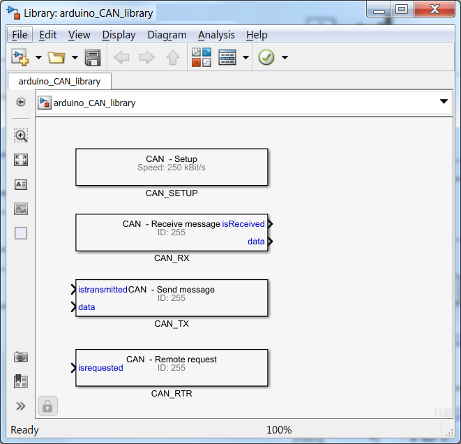

# arduino_CAN
MATLAB-Simulink code generation library for Arduino SparkFun CAN-BUS Shield. However it shall work with any hardware based on MCP2515 chip.

All toolchain validation was performed in R2017b (that's also the version used for Simulink libraries and MEX-files are compilation).

For simple demo application please refer to Simulink models in "examples/simple" or "examples/packandunpack" folders.

Pre-requisities:
  1. MATLAB, Simulink and Simulink Coder
  2. Simulink Support Package for Arduino Hardware
  2. SparkFun CAN-BUS Shield for Arduino (https://www.sparkfun.com/products/13262)
  
Please note that this repository relies has some externals coming from SparkFun CAN-Bus_Shield library (https://github.com/sparkfun/CAN-Bus_Shield.git). There libraries are referenced from this repository so it shall work out of the box.

To run it with different version of MATLAB (e.g. older R2014b), you might need to recompile the MEX functions by running "build_sfunctions\compile_arduino_CAN_to_mex.m". This recompiles the MEX-files for given version of MATLAB and copies them to the root directory.
