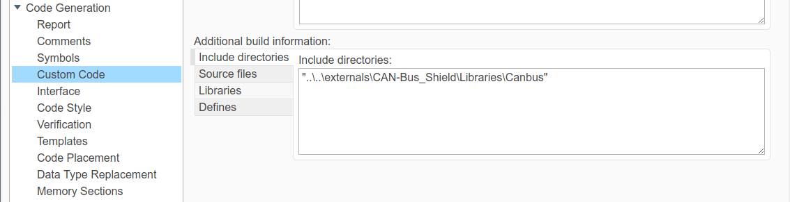
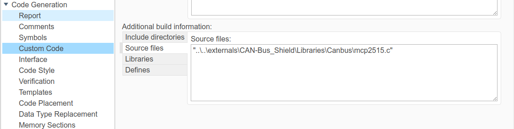

# arduino_CAN_simple_example

Please note that in your code generation settings of your Simulink model you must:

1) Include additional directories

2) Include additional source code

Otherwise the build will not succeed as these files are required.